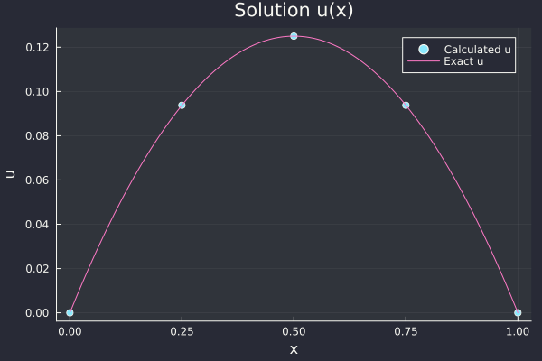
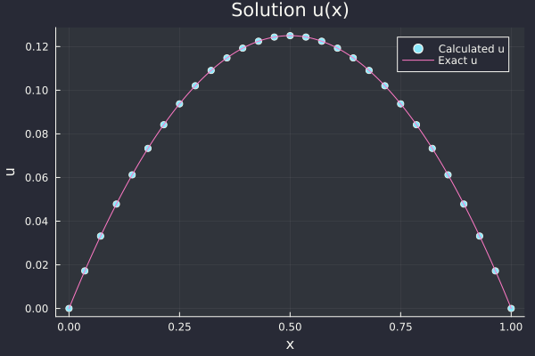
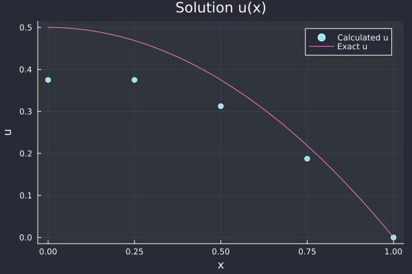
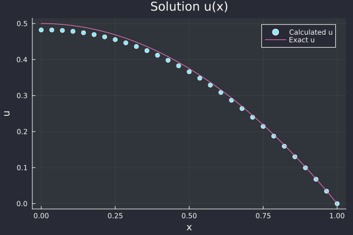
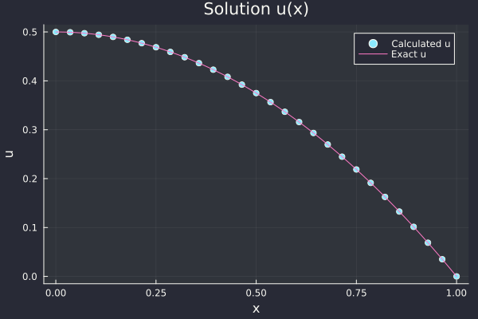

# Lecture 2: Differential and Difference Equations


## Introduction

Consider a scenario where a thin bar is put on an infinite block of ice at both ends and there a blowtorch heating it along it's length. The task is to find the temperature at several locations along the bar when it reaches steady state (i.e. after a very very long time of heating).

```


```

The differential equation (with boundary conditions) explaining this phenomenon is given as 
$$
-\frac{d^2u}{dx^2}=f(x)=1;\ \ \ \ \ \ \ \ \ \ \ u(0)=0, u(1)=0 \tag{1}
$$
where $u(x)$ is the temperature at location $x \in [0,1]$ and the "ice at the ends" mean the temperature at $u(0)=u(1)=0$ always! The heat from blowtorch is represented using the function $f(x)$ and it's set to a constant because it's uniform.

Let's look at this differential equation analytically. What we need is some function $u(x)$ that satisfies $-\frac{d^2u}{dx^2}=1$. In other words, the second derivative of $u(x)$ should be $-1$. A function $u(x)=-\frac{1}{2}x^2$ satisfies this differential equation. So does another function $u(x)=-\frac{1}{2}x^2+Cx+D$, where $C$ and $D$ can be any constants! This is where Boundary Conditions come in and fix $C$ and $D$ values! This way we get an exact solution as $u(x)=-\frac{1}{2}x^2+\frac{1}{2}x$

>  Boundary Conditions enables a unique solution to the PDE! Hence they are very important in solving PDEs.


## Difference Equations

In order to solve the differential equation numerically, we have to represent it as a difference equation where the derivatives are defined or approximated numerically.
$$
- \frac{u_{i+1}-2u_i+u_{i-1}}{(\Delta x)^2}=f(x_i)=1 \tag{2}
$$
The above mentioned approximation to the derivative is defined using Finite Differences.

Let's take a look at a few finite difference formulae approximating the 1st order derivative:

- **Forward Difference**
  $$
  \Delta_F u=\frac{u(x+h)-u(x)}{h} \approx u'+\mathcal{O}(h) \tag{3}
  $$

- **Backward Difference**
  $$
  \Delta_B u=\frac{u(x)-u(x-h)}{h} \approx u'+\mathcal{O}(h) \tag{4}
  $$

- **Centered Difference**
  $$
  \Delta_C u=\frac{u(x+h)-u(x-h)}{2h} \approx u'+\mathcal{O}(h^2) \tag{5}
  $$

These finite difference formulae are derived using Taylor Series, which says that
$$
u(x+h)=u(x)+hu'(x)+\frac{h^2}{2!}u''(x)+\frac{h^3}{3!}u'''(x)+\cdots \tag{6}
$$

$$
u(x-h)=u(x)-hu'(x)+\frac{h^2}{2!}u''(x)-\frac{h^3}{3!}u'''(x)+\cdots \tag{7}
$$

Rearranging Equation $(6)$, we can get the Forward Difference approximation to the 1st order derivative:
$$
\begin{aligned}
\frac{u(x+h) - u(x)}{h} &= u'(x)+\frac{h}{2!}u''(x)+\frac{h^2}{3!}u'''(x)+\cdots \\ 
                        &= u'(x)+\mathcal{O}(h) 
\end{aligned} \tag{8}
$$
Similarly using Equation $(7)$, we can get the Backward Difference approximation:
$$
\begin{aligned}
\frac{u(x) - u(x-h)}{h} &= u'(x)-\frac{h}{2!}u''(x)+\frac{h^2}{3!}u'''(x)+\cdots \\ 
                        &= u'(x)+\mathcal{O}(h)
\end{aligned} \tag{9}
$$
Finally, subtracting $(6)$ from $(7)$, we get Centered Difference approximation:
$$
\begin{aligned}
\frac{u(x+h) - u(x-h)}{2h} &= u'(x)+\frac{2h^2}{3!}u'''(x)+\cdots \\ 
                        &= u'(x)+\mathcal{O}(h^2) 
\end{aligned} \tag{10}
$$

> Notice how we get 1st and 2nd order accuracy depending on the terms left after moving them around.

Now we can get 2nd order derivatives in three ways:

- $\Delta_F \Delta_B$

- $\Delta_B \Delta_F$

- $\Delta_C \Delta_C$ : This would be a weird choice because it will stretch too far on the stencil in a way that we get coefficients as $1\ \ \ \ \ 0\ \ \ \ \ -2\ \ \ \ \ \ \ \ 0\ \ \ \ \ \ \ 1$. 

  >  This might sound unfamiliar, but I've discussed discretisation and stencil in the next section.

Apart from this, we can also get $\Delta_F \Delta_B$ or $\Delta_B \Delta_F$ by adding $(6)$ and $(7)$ together:
$$
\begin{aligned}
\frac{u(x+h) - 2u(x) + u(x-h)}{h^2} &= u''(x)+\frac{2h^2}{4!}u''''(x)+\cdots \\ 
                        &= u''(x)+\mathcal{O}(h^2) 
\end{aligned} \tag{11}
$$


## Numerical Discretisation and Solution

The very first step to solving a differential equation numerically is discretisation of the domain. Consider the PDE in Equation $(1)$, where the domain lies between 0 and 1. What discretisation does is instead of using a continuous domain, it uses a set of finite points on the domain to represent it (shown in diagram below). In this example, we will discretise this into 5 equispaced points with $\Delta x=0.25$ as the distance between two consecutive points. Also, each point is indexed using the small letter $i=0, 1, 2, 3, 4, 5$.

```


```

> Using 5 points to discretise any practical problem might be a bad idea, but for understanding it's better to keep $n$ small.

The problem now is to find $u_0, u_1, u_2, u_3 \text{ and } u_4$, as these 5 values will essentially represent the function describing $u$. This is where we turn our attention to Equation $(2)$, and start setting different values to subscript $i$ and form a set of equations.

-  When $i=1$
  $$
  -u_2+2u_1-u_0=(0.25)^2 \tag{12}
  $$

- When $i=2$
  $$
  -u_3+2u_2-u_1=(0.25)^2 \tag{13}
  $$

- When $i=3$
  $$
  -u_4+2u_3-u_2=(0.25)^2 \tag{14}
  $$

-  

We now have 3 equations and 3 unknowns ($u_1, u_2, u_3$). Remember that we already know the boundary conditions which states that $u_0=u_4=0$. 

The above defined set of equations can also be rewritten in terms of matrix vector multiplication,
$$
\begin{pmatrix} 2 & -1 & 0 \\ -1 & 2 & -1 \\ 0 & -1 & 2 \end{pmatrix}\begin{pmatrix} u_1 \\ u_2 \\ u_3 \end{pmatrix}=\begin{pmatrix} (0.25)^2 & \\ (0.25)^2 \\ (0.25)^2 \end{pmatrix} \tag{15}
$$
If you remember from Lecture 1, the left side $3 \times 3$ matrix is $K_3$ and it's invertible! For now, let's just use some computer program to solve this $A\textbf{u}=b$ and get the vector $\textbf{u}$. 

```julia
# Total internal points excluding boundaries
n = 3

# x values
x = range(0, 1, n+2)
# i indices
i = range(0, n-1, n+2);

# dx
Δx = x[2] - x[1];

# Function define matrix A
function coefficient(n::Int)
    # A matrix
    A = zeros(n, n)
    for i=1:n
        # Diagonal Elements
        A[i,i] = 2
        if i ≠ 1
            # Lower Diagonal
            A[i, i-1] = -1
        end
        if i ≠ n
            # Upper diagonal
            A[i, i+1] = -1
        end
    end
    return A
end

# Coefficient matrix
A = coefficient(n)

# RHS 
b = ones(n) * (Δx^2)

# Solve
u = A\b

println("Solution u: ", u)

# Appending boundary values to solution
pushfirst!(u, 0);
push!(u, 0);

# Plotting
scatter(x, u, label="u", xlabel="x", ylabel="u", title="Solution u(x)")
```



We can now increase the number of points $n$ to get more accurate solution, for example if $n=30$.




## Changing the Boundary Conditions

Let's change something with the problem setup and remove the ice block at $x=0$! What this means is that we now have a PDE with different boundary conditions
$$
-\frac{d^2u}{dx^2}=f(x)=1;\ \ \ \ \ \ \ \ \ \ \ \frac{\partial u}{\partial x}\bigg|_{x=0}=0, u(1)=0 \tag{16}
$$

> Remember that the problem is of steady state, hence the change in temperature at $x=0$ is set to $0$!

Again setting $n=5$, the problem now is to find $u_0, u_1, u_2, u_3 \text{ and } u_4$. In this case we know that, $u_4=0$ which leaves 4 unknown variables. Again using the approximations to convert differential equation to difference equation and also approximating the boundary condition at $x=0$ using Equation $(8)$ we get a set of equations as follows

- Boundary Condition Approximation
  $$
  u_1 - u_0 = 0 \tag{17}
  $$

- When $i=1$, we can use the fact that $u_1=u_0$ and reduce the unknown variables to 3!
  $$
  -u_2+2u_1-u_0=(0.25)^2 \\ 
  \text{or} \\
  -u_2+u_1=(0.25)^2 \tag{18}
  $$

- When $i=2$
  $$
  -u_3+2u_2-u_1=(0.25)^2 \tag{19}
  $$

- When $i=3$
  $$
  -u_4+2u_3-u_2=(0.25)^2 \tag{20}
  $$

Now, we have 3 equations and 3 variables, which can again be represented as a matrix vector multiplication 
$$
\begin{pmatrix} 1 & -1 & 0 \\ -1 & 2 & -1 \\ 0 & -1 & 2 \end{pmatrix}\begin{pmatrix} u_1 \\ u_2 \\ u_3 \end{pmatrix}=\begin{pmatrix} (0.25)^2 & \\ (0.25)^2 \\ (0.25)^2 \end{pmatrix} \tag{21}
$$
Again from Lecture 1, the left side $3 \times 3$ matrix is $T_3$ and it's invertible! Let's again use the inbuilt matrix solver to solve this $A\textbf{u}=b$ and get the vector $\textbf{u}$.

```julia
function coefficient_T(n::Int)
    # A matrix
    A = zeros(n, n)
    for i=1:n
        # Diagonal Elements
        if i == 1
            A[i,i] = 1
        else
            A[i,i] = 2
        end
        if i ≠ 1
            # Lower Diagonal
            A[i, i-1] = -1
        end
        if i ≠ n
            # Upper diagonal
            A[i, i+1] = -1
        end
    end
    return A
end
```



Similarly, if we increase the number of points, we get a more accurate solution!



> An interesting observation is that for the previous case where the boundary conditions were fixed, we got accurate solution even when $n=3$, but that is not the case here. It's just a matter of getting lucky where the equispaced points and the constant force term matched up such that it ended up as a perfect scenario. Rest be assured, if you change anything like variable forcing term, it'll give less accurate solution for smaller $n$ values but that will still be $\mathcal{O}(h^2)$ accurate. 
>
> However, in this case we approximated the left boundary using the backward difference formula which is $\mathcal{O}(h)$ accurate. Hence, we'll get the final solution which is also $\mathcal{O}(h)$ accurate (error propagates!).

For this simple problem, we can actually get a $\mathcal{O}(h^2)$ accuracy! Let's do that...

Now, we have an idea that the solution should be parabolic (this can be confirmed using the exact solution). What we can do is use this fact which will give that $u_{-1} = u_1$, and instead of using forward difference we can use centered difference 
$$
\frac{\partial u}{\partial x}\bigg|_{x=0} = \frac{u_1 - u_{-1}}{2 \Delta x} = 0 \tag{22}
$$
By using this, we again increase the unknown variables to 4, i.e. we need to find $x_0, x_1, x_2 \text{ and } x_3$. 

- When $i=0$, we can use the fact that $u_1=u_{-1}$
  $$
  -u_1+2u_0-u_{-1}=(0.25)^2 \\ 
  \text{or} \\
  2u_0-2u_1=(0.25)^2 \tag{23}
  $$

- When $i=1$
  $$
  -u_2+2u_1-u_0=(0.25)^2 \tag{24}
  $$

- When $i=2$
  $$
  -u_3+2u_2-u_1=(0.25)^2 \tag{25}
  $$

- When $i=3$
  $$
  -u_4+2u_3-u_2=(0.25)^2 \tag{26}
  $$

Now, we have 4 equations and 4 variables, which can again be represented as a matrix vector multiplication 
$$
\begin{pmatrix} 1 & -1 & 0 & 0 \\ -1 & 2 & -1 & 0 \\ 0 & -1 & 2 & -1 \\ 0 & 0 & -1 & 2 \end{pmatrix}\begin{pmatrix} u_0 \\ u_1 \\ u_2 \\ u_3 \end{pmatrix}=\begin{pmatrix} \frac{(0.25)^2}{2} \\ (0.25)^2 & \\ (0.25)^2 \\ (0.25)^2 \end{pmatrix} \tag{21}
$$
Solving this system of equation, we get the following solutions...




> This is $\mathcal{O}(h^2)$ accurate!
